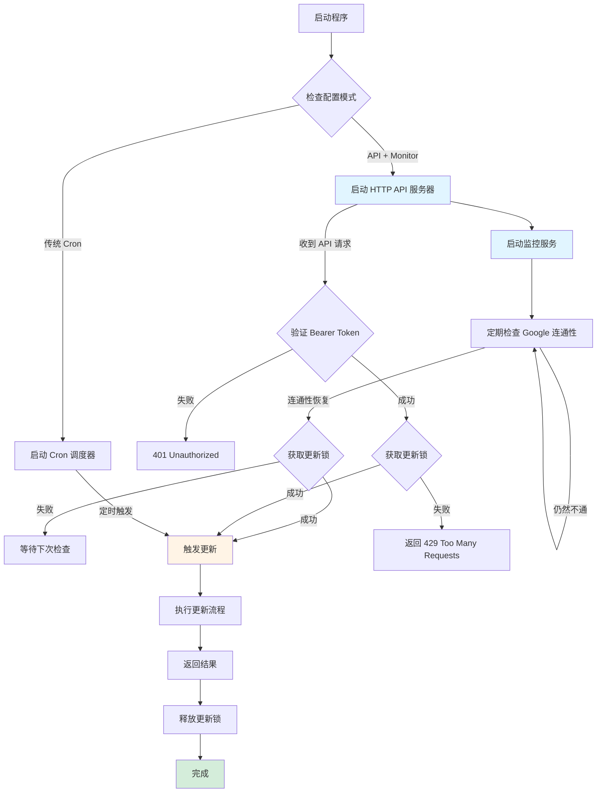
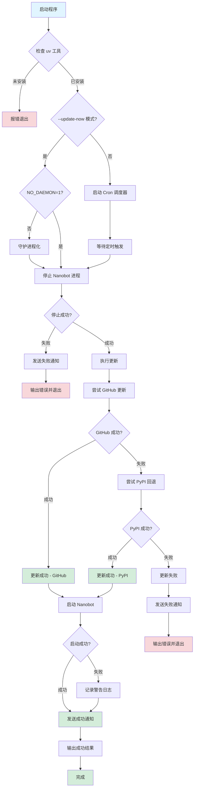

# Update Flow

> This content was extracted from README.md for better organization.

## 更新执行流程

了解程序内部的完整更新流程，帮助你更好地理解和调试问题。

### v0.3 架构流程图



### 详细更新流程图（核心流程）



### 详细步骤说明

#### 1. 启动检查阶段
- **检查 uv 工具**: 验证 `uv` 是否已安装且可用
- **加载配置**: 读取 `config.yaml` 配置文件
- **初始化日志**: 创建日志目录和日志记录器

#### 2. 守护进程化（可选）
- **触发条件**: 使用 `--update-now` 且环境变量 `NO_DAEMON != "1"`
- **目的**: 确保更新进程在 Nanobot 停止后仍能继续运行
- **行为**: 程序会脱离父进程独立运行，日志重定向到 `logs/daemon.log`
- **注意**: v0.3 推荐使用 HTTP API 模式，守护进程化主要用于 CLI 模式

#### 3. 停止 Nanobot
- **检测进程**: 通过进程名和端口检测运行中的 Nanobot
- **优雅停止**: 使用 `taskkill` 命令优雅终止进程
- **超时保护**: 5 秒内未停止则强制终止
- **错误处理**: 停止失败则取消整个更新流程

#### 4. 执行更新
- **双源策略**:
  1. **首选 GitHub**: 从 `git+https://github.com/HKUDS/nanobot.git` 安装最新版本
  2. **回退 PyPI**: GitHub 失败时从 PyPI 安装稳定版本 `nanobot-ai`
- **强制更新**: 使用 `--force` 标志确保覆盖现有版本
- **心跳监控**: 每 10 秒记录一次更新进度日志
- **超时控制**: 默认 5 分钟超时保护

#### 5. 启动 Nanobot
- **后台启动**: 使用 `Start-Process` 在后台启动 Nanobot
- **启动验证**: 等待最多 30 秒确认启动成功
- **容错处理**: 启动失败不影响更新成功状态（可手动启动）

#### 6. 通知和输出
- **Pushover 通知**: 发送成功/失败通知到用户设备
- **JSON 输出**: `--update-now` 模式输出结构化 JSON 结果
- **日志记录**: 完整记录所有操作和错误信息

### 关键设计决策

| 决策点 | 选择 | 原因 |
|--------|------|------|
| 停止失败处理 | 取消更新 | 避免更新过程中程序仍在运行导致不一致 |
| 更新失败处理 | 不启动 Nanobot | 防止启动损坏的版本 |
| 启动失败处理 | 警告但不失败 | 更新已成功，用户可手动启动 |
| 双源策略 | GitHub -> PyPI | 兼顾最新功能和稳定性 |
| 守护进程 | 自动（可禁用） | 平衡易用性和调试需求 |

### 流程时间线示例

典型的成功更新时间线：

```
00:00.000 - [INFO] 检查 uv 安装
00:00.050 - [INFO] uv is installed and available
00:00.100 - [INFO] 守护进程化启动
00:00.200 - [INFO] 开始停止 Nanobot (PID: 12345)
00:02.500 - [INFO] Nanobot 停止成功
00:02.600 - [INFO] 开始从 GitHub 更新
00:12.000 - [INFO] Update heartbeat: still running... (10s elapsed)
00:22.000 - [INFO] Update heartbeat: still running... (20s elapsed)
00:28.500 - [INFO] GitHub 更新成功
00:28.600 - [INFO] 启动 Nanobot
00:35.200 - [INFO] Nanobot 启动成功
00:35.300 - [INFO] 发送成功通知
00:35.400 - [INFO] 更新完成
```
